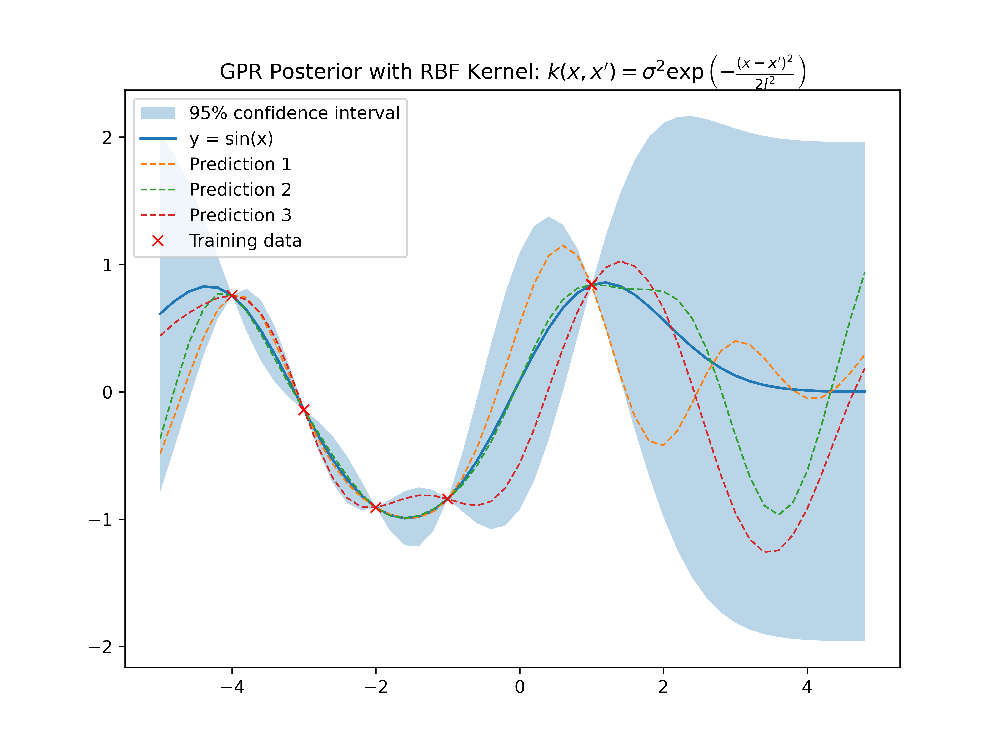

# Gaussian Process Regression (GPR)

A custom implementation of Gaussian Process Regression for uncertainty quantification in non-linear regression tasks. This module implements exact inference without relying on high-level GP libraries (like GPyTorch or GPflow) to demonstrate the underlying linear algebra.

## Theoretical Background

A Gaussian Process is a distribution over functions, completely specified by a mean function $m(x)$ and a covariance (kernel) function $k(x, x')$.

$$f(x) \sim \mathcal{GP}(m(x), k(x, x'))$$

For a dataset $\mathcal{D} = \{(x_i, y_i)\}$, the posterior distribution for a new test point $x_*$ is Gaussian with mean and variance derived from the kernel matrix $K$:

$$\mu_* = K_*^T (K + \sigma_n^2 I)^{-1} y$$
$$\Sigma_* = k(x_*, x_*) - K_*^T (K + \sigma_n^2 I)^{-1} K_*$$

## Implementation Details

* **Kernel:** Radial Basis Function (RBF) / Squared Exponential Kernel.
    * $k(x, x') = \sigma_f^2 \exp\left( -\frac{1}{2l^2} (x - x')^2 \right)$
* **Inference:** Computes the posterior using Cholesky decomposition for numerical stability.
* **Hyperparameters:** Length-scale $l$ and signal variance $\sigma_f$ are tunable.

## Results

### Posterior Distribution & Uncertainty
The plot below visualizes the model's "belief" about the function.
* **Solid Line:** The mean prediction.
* **Shaded Region:** The 95% confidence interval ($2\sigma$). Note how the uncertainty "pinches" (contracts) near observed data points and expands in unobserved regions.
* **Dashed Lines:** Random function samples drawn from the posterior distribution.

