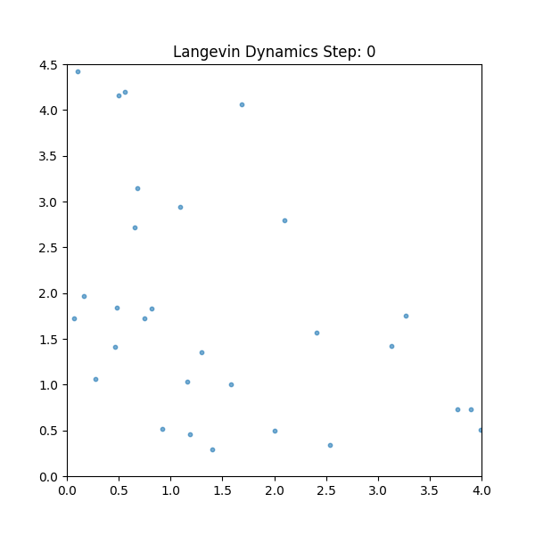
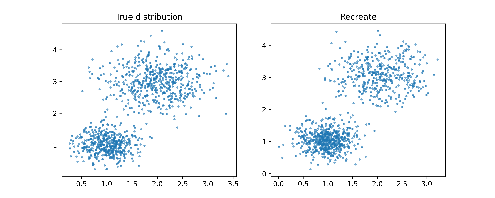

# Noise Conditional Score Network

Reproduce the SDE Score Network from the paper titled [Generative Modeling by Estimating Gradients of the Data Distribution](https://arxiv.org/abs/1907.05600)

## Theoretical Background
The goal is to learn the score function $s_\theta(x) \approx \nabla_x \log p(x)$.
We minimize the **Fisher Divergence** using the Denoising Score Matching objective:

$$\mathcal{L}(\theta) = \mathbb{E}_{x, \tilde{x}} \left[ || s_\theta(\tilde{x}) - \nabla_{\tilde{x}} \log p(\tilde{x}|x) ||_2^2 \right]$$

*(Note: Adding LaTeX math here makes you look incredibly professional.)*

## Results
### Langevin Dynamics Sampling
The following animation shows the sampling process using **Annealed Langevin Dynamics**. The particles (blue) start as random noise and follow the learned vector field to the high-density regions of the data distribution.



### Mode Coverage
Comparison of the ground truth Mixture of Gaussians (left) vs. the learned distribution (right).


## 🚀 Usage
```bash
python main.py
```