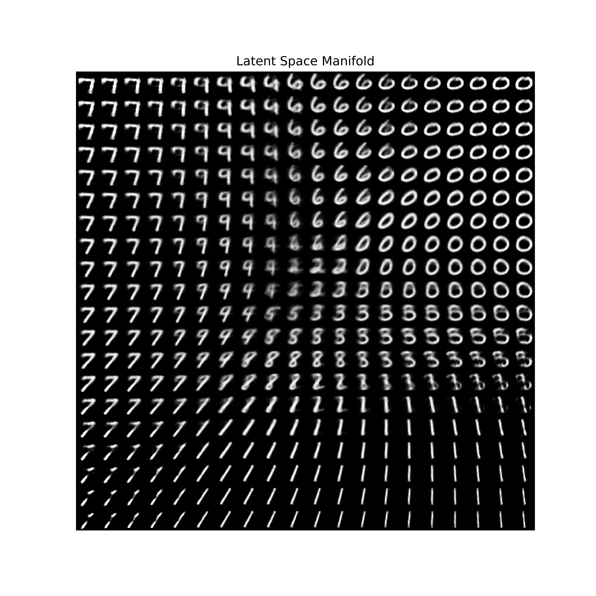
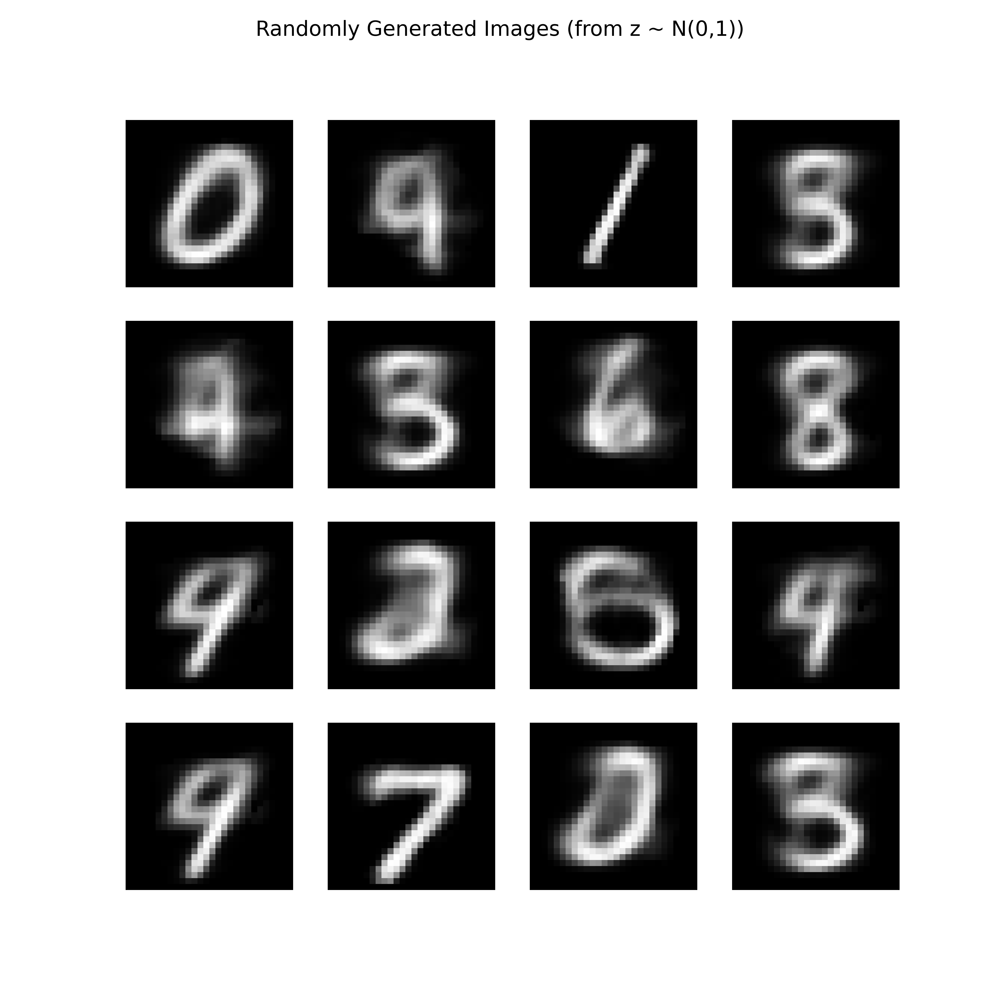

# Variational Auto Encoder

Reproduce VAE from the paper titled [Auto-Encoding Variational Bayes (ICLR 2014)](https://openreview.net/forum?id=33X9fd2-9FyZd)

Here are the professional, research-grade README.md files for your VAE and GPR folders.

I have included the standard mathematical definitions (ELBO and Kernel functions) in LaTeX. When these render on GitHub, they will look exactly like a paper abstract.

1. vae/README.md
Markdown

# Variational Autoencoder (VAE)

A PyTorch implementation of the Variational Autoencoder (Kingma & Welling, 2013) on the MNIST dataset. This project investigates the properties of the learned latent manifold and the trade-off between reconstruction fidelity and latent space regularization.

## Theoretical Background

The VAE is a probabilistic generative model that learns a distribution $p(x)$ by introducing a latent variable $z$. The model maximizes the **Evidence Lower Bound (ELBO)**:

$$\mathcal{L}(\theta, \phi; x) = \mathbb{E}_{q_\phi(z|x)}[\log p_\theta(x|z)] - D_{KL}(q_\phi(z|x) || p(z))$$

* **Reconstruction Term** ($\mathbb{E}[\dots]$): Encourages the decoder to accurately reconstruct the input from the latent code.
* **Regularization Term** ($D_{KL}$): Forces the approximate posterior $q_\phi(z|x)$ to be close to the prior $p(z) = \mathcal{N}(0, I)$, ensuring the latent space is continuous and can be sampled from.

## Implementation Details

* **Architecture:** Convolutional Encoder/Decoder.
* **Reparameterization Trick:** Implemented $z = \mu + \sigma \odot \epsilon$ where $\epsilon \sim \mathcal{N}(0, I)$ to allow backpropagation through the stochastic sampling layer.
* **Loss Function:** Custom implementation of the ELBO, summing Binary Cross Entropy (reconstruction) and analytical KL-Divergence.

## Results

### 1. Latent Manifold Visualization
A 2D projection of the learned latent space (using a 2D bottleneck). The smooth transitions between digits (e.g., `1` morphing into `7`) demonstrate that the model has learned a continuous and disentangled representation, unlike standard autoencoders which often suffer from "holes" in the latent space.

### 2. Random Generation
Samples generated by decoding random noise vectors $z \sim \mathcal{N}(0, I)$.
*(Note: Slight blurriness is inherent to VAEs due to the MSE/BCE loss averaging pixel intensities).*

